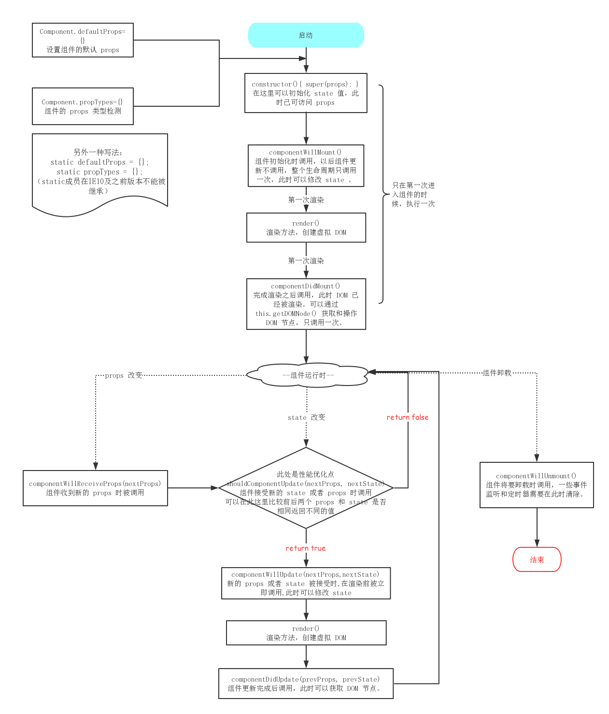

### 组件的生命周期

1、当组件在客户端被实例化，第一次被创建时，以下方法依次被调用：
* getDefaultProps
* getInitialState
* componentWillMount
* render
* componentDidMount

2、当组件在服务端被实例化，首次被创建时，以下方法依次被调用：
* getDefaultProps
* getInitialState
* componentWillMount
* render
componentDidMount 不会在服务端被渲染的过程中调用。

```
import React, {Commponent} from 'react'
import ReactDOM from 'react-dom';

class SubCounter extends Component {
  componentWillReceiveProps() {
      console.log('9、子组件将要接收到新属性');
  }

  shouldComponentUpdate(newProps, newState) {
      console.log('10、子组件是否需要更新');
      if (newProps.number < 5) return true;
      return false
  }

  componentWillUpdate() {
      console.log('11、子组件将要更新');
  }

  componentDidUpdate() {
      console.log('13、子组件更新完成');
  }

  componentWillUnmount() {
      console.log('14、子组件将卸载');
  }

  render() {
      console.log('12、子组件挂载中');
      return (
              <p>{this.props.number}</p>
      )
  }
}

class Counter extends Component {
  static defaultProps = {
      //1、加载默认属性
      name: 'sls',
      age:23
  };

  constructor() {
      super();
      //2、加载默认状态
      this.state = {number: 0}
  }

  componentWillMount() {
      console.log('3、父组件挂载之前');
  }

  componentDidMount() {
      console.log('5、父组件挂载完成');
  }

  shouldComponentUpdate(newProps, newState) {
      console.log('6、父组件是否需要更新');
      if (newState.number<15) return true;
      return false
  }

  componentWillUpdate() {
      console.log('7、父组件将要更新');
  }

  componentDidUpdate() {
      console.log('8、父组件更新完成');
  }

  handleClick = () => {
      this.setState({
          number: this.state.number + 1
      })
  };

  render() {
      console.log('4、render(父组件挂载)');
      return (
          <div>
              <p>{this.state.number}</p>
              <button onClick={this.handleClick}>+</button>
              {this.state.number<10?<SubCounter number={this.state.number}/>:null}
          </div>
      )
  }
}
ReactDOM.render(<Counter/>, document.getElementById('app'));
```
