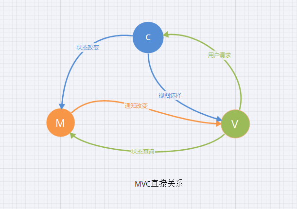
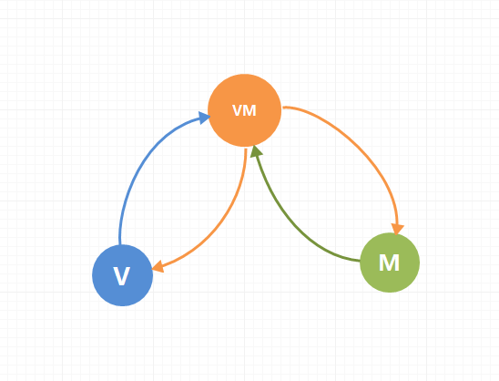

### vue核心

* Vue.js 是一套构建用户界面(UI)的渐进式JavaScript框架

### MVC
* M：model数据模型,专门操作数据的CRUD；
* V：veiw视图模型，就是前端页面展示的效果图；
* C：controller 控制器层,处理业务逻辑；V与M的桥梁;



### MVVM
* M: model数据模型；
* V: view视图；
* VM: viewModel 视图模型；



> MVVM通过数据双向绑定让数据自动地双向同步(数据是核心)

### 安装
```
1、 npm install --global vue-cli

2、 vue init webpack myVue

3、 cd myVue

4、 npm install / cnpm i

5、 npm run dev

